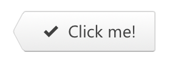

---
revealOptions:
  transition: slide
  controls: false
---


<br /><br />

# CLICK THE BUTTON

## The hard way

<br /><br />

<sub>Дмитрий Лазарев</sub>

Note: Меня зовут Дмитрий Лазарев. Сегодня я вам расскажу про то как иногда бывает трудно кликнуть по кнопке. И поделюсь тем с чем мне пришлось столкнутся, когда пытался написать тест, который просто делает честный клик. Но перед этим пара слов про команду.

---


Note: Я работаю в команде Формы контур.экстерна. Как можно догадаться по названию мы делаем формы. Но как и все нормальные разработчики, нам лень заниматься рутинной работой, поэтому мы занимается кодогенерацией. Пишем код, который делает формы за нас. В основном это формы отчетности в контролирующие органы: ФНС, РосСтат, ПФР и тд.

---


Note: Вот так например выглядит часть формы отчетности по НДС.

---


Note: Как я уже говорил, нельзя просто так взять и кликнуть по кнопке, особенно в тестах и тем более если хочется делать честные клики. Вы спросите почему? И чтобы ответить на этот вопрос на поможет вот этот чувак.

---


### Майк Кон

<!-- .element class="fragment" data-fragment-index="1" -->

Scrum. Гибкая разработка ПО

<!-- .element class="fragment" data-fragment-index="1" -->

Note: Поднимите руки те кто знает что это за чувак. Пауза. (Что никто не знает? / О, я не ожидал что есть те кто его знают) Его зовут Майк Кон, автор книги "Scrum. Гибкая разработка ПО" и он один из соавторов самой методологии Scrum. В своей книге он описывает концепт тестовой пирамиды.

---

## The Test Pyramid


Note: Тестовая пирамида прекрасно иллюстрирует категории тестов и их особенности. Можно увидеть, что при движении вверх по пирамиде растет не только размер теста и покрываемое им кол-во кода, но также растет стоимость поддержки и время выполнения. Поэтому важно правильно выбрать подходящий под требования уровень.

---

## Требования к тестам

- Честные клики <!-- .element class="fragment" data-fragment-index="1" -->
- Тестирование взаимодействия <!-- .element class="fragment" data-fragment-index="2" -->
- Оптимальное время выполнения <!-- .element class="fragment" data-fragment-index="3" -->
- Стабильность <!-- .element class="fragment" data-fragment-index="4" -->

Note: Чего же мы хотим от тестов? Честные клики, как же без них, под честными кликами я подразумеваю любое пользовательское действие. Тестирование взаимодействия. Мы хотим тестировать взаимодействие частей приложения между собой, а не всё приложение целиком. Оптимальное время выполнения. Ну кто не хочет чтобы его тесты проходили быстро. И Стабильность. Конечно же не хочется, чтобы тест падал в зависимости от фазы луны или дня недели. Отсюда можно сделать вывод, оптимальным вариантом для нас будут интеграционные тесты. E2E тесты слишком медленные и нестабильные. А юнит тесты...

---

## 2 unit tests, 0 integration tests


Note: Это юнит тесты. С помощью них нельзя протестировать взаимодействие. Давайте напишем такие тесты на нашу офигенско-крутую кнопку.

---



```jsx
class AwesomeButton extends React.Component {
  // ...
  render() {
    // ...
    return (
      <span {...wrapProps}>
        <div className={classes}>
          <button ref={this._ref} {...rootProps}>
            <Icon name="Ok" />
            {'Click me!'}
          </button>
        </div>
      </span>
    );
  }
}
```


Note: Будем считать, что AwesomeButton это типичный React компонент. Он содержит в себе кучу сложной верстки, бизнес-лапшу в методах. И где-то там внутри есть элемент button, по которой мы хотим кликать. Попробуем сделать это использовав Enzyme.

---

## Enzyme

 <!-- .element style="width: 55%; float: left;" -->

<!-- .element style="width: 40%; float: left;" -->

https://airbnb.io/enzyme/

Note: Enzyme (Энзайм) — это библиотека для тестирования React компонентов от Airbnb. Кто-нибудь использует Enzyme? Пауза. Enzyme/Он предоставляет удобное API для взаимодействия с тестируемым компонентом, позволяет проверить его поведение при изменении props или state, а также вызовы life-cycle методов и правильность разметки.

---

## Enzyme

```typescript
import { mount } from 'enzyme'

const wrapper = mount(<AwesomeButton />)
wrapper.find('button').simulate('click')
```

```typescript
// Тоже самое что и
wrapper.find('button').prop('onClick')()
```

<!-- .element class="fragment" data-fragment-index="1" -->

```typescript
// Работать не будет
wrapper.simulate('click')
```

<!-- .element class="fragment" data-fragment-index="2" -->

- <!-- .element class="fragment" data-fragment-index="3" --> Нечестные клики, вызов `props.onClick`
- <!-- .element class="fragment" data-fragment-index="3" --> Завязка на внутреннюю разметку

Note: Чтобы кликнуть по нашей кнопке, для начала нужно её отрендерить. Функция mount отрисовывает кнопку, как если бы она отрисовывалась прямо в браузере с помощью ReactDOM.render. Результатом mount будет объект wrapper с хелпер методами для взаимодействия с компонентом. Далее мы находим элемент button и вызываем на нем simulate('click'). Вроде всё хорошо, но есть две проблемы. Первая это знание о внутреней разметке компонента в коде теста, что не есть хорошо. И вторая simulate('click') это ничто иное, как просто вызов функции onClick из props нашей кнопки. Именно так работает enzyme под капотом. И именно поэтому simulate('click') на враппере не сработает, так как в AwesomeButton мы не передаем никаких props. В результате мы получили, нечестные клики и завязку на внутрености компонента. Enzyme не подходит под наши требования. Попробуем взять TestCafe.

---

 <!-- .element style="background: #fff; padding: 20px" -->

https://devexpress.github.io/testcafe/

Note: TestCafe — это аналог selenium'а для e2e тестов, он проще в использовании и не требует установки WebDriver'а. Имеет механизм умных тайм-аутов и поддержку TypeScript'а из коробки. Давайте напишем простой тест, который кликает по нашей кнопке.

---

## TestCafe

```typescript
fixture `AwesomeButton Tests`
	.page `http://localhost:3000/awesome-button`

test('Should click the button', async t => {
    await t.click('[data-comp-name=AwesomeButton]')
    // ...
})
```

Note: В начале мы объявляем название для группы тестов и страничку на которой будет отрисовываться наша кнопка. Далее сам тест, где в колбеке принимаем тестовый контроллер, объект для взаимодействия со страницей. Выглядит достаточно лаконично. Усложним пример.

---

## TestCafe

```typescript
import { ClientFunction } from 'testcafe'

const getInternalMethodArgs = ClientFunction(() => {
    // Возвращаем информацию о вызове внутреннего метода
    return window.wasInternalMethodCalledWithArgs()
})

fixture `AwesomeButton Tests`
	.page `http://localhost:3000/awesome-button`

test('Should click the button', async t => {
    await t.click('[data-comp-name=AwesomeButton]')

    const expectedArgs = [ /* ... */ ]
    const receivedArgs = await getInternalMethodArgs()

    await t.expect(receivedArgs).eql(expectedArgs)
})
```

Note: Код теста выполняется в nodejs окружении. А для тестирования взаимодействия нужно получать информацию о вызове метода приложения из браузера. Для этого мы можем написать глобальную хелпер функцию, возвращающую эту информацию. Колбек переданный в ClientFunction выполнится на стороне браузера и вернет результат выполнения в тест, где мы его и проверим. В принципе с этим можно жить, но только если вы готовы написать кучу хелпер методов, подготовить под каждый компонент свою страничку и возможно даже не одну. Я не готов, поэтому идем дальше. Но прежде, ещё пару слов про TestCafe.

---

## TestCafe

 <!-- .element style="width: 80%; background: #fff; padding: 0 40px" -->

Note: Как я уже говорил, TestCafe в отличии от Selenium не требует установка WebDriver'а. Внутри себя он использует механизм URL-Rewriting Proxy, с помощью которого на страницу инжектятся скрипты, позволяющие эмулировать пользовательские действия. Для этого используется обычное DOM Events API. Вот его-то мы и заиспользуем.

---

## DOM Events

```typescript
const selector = '[data-comp-name=AwesomeButton]'
const button = document.querySelector(selector)
button.querySelector('button').click()

// Или
const event = new MouseEvent('click', { /* ... */ })
button.querySelector('button').dispatchEvent(event)
```

```typescript
const {x, y, width, height} = button.getBoundingClientRect()
const realButton = document
	// Надеемся, что кнопка где-то в середине :)
	.elementFromPoint(x + width / 2, y + height / 2)
```

<!-- .element class="fragment" data-fragment-index="2" -->

- <!-- .element class="fragment" data-fragment-index="1" --> Завязка на внутреннюю разметку

Note: Как мы уже знаем, наш компонент содержит много сложной верстки. И как в случае с Enzyme нам приходится искать элемент button по которому нужно кликать. Я не стал раскапывать то, как в TestCafe решили эту проблему и использовал другой подход. Но когда я готовил презентацию я нашел способ её решить с помощью elementFromPoint, пускай получилось немного костыльно, но зато это работает. А сейчас я расскажу о решении на котором я остановился. Оно появилось при попытке использовать Chrome DevTools Protocol.

---

## Chrome DevTools Protocol


https://chromedevtools.github.io/devtools-protocol/

Note: Кто-нибудь знает что это за зверь такой? Пауза. CDP — это низкоуровневое API для управления браузером Chrome. Оно позволяет делать множество интересных вещей с браузером. Например взаимодействовать с DOM, отлаживать скрипты, заниматься профилированием, работать с сетью, но самое главное эмулировать пользовательские действия. Попробуем воспользоваться.

---

## Chrome DevTools Protocol

```bash
chrome --remote-debugging-port=9222
open http://localhost:9222
```

 <!-- .element class="fragment" data-fragment-index="1" width="80%" -->

Note: Для этого надо запустить хром в режиме отладки с флагом remote-debugging-port. После этого зайти на локалхост по этому порту и перейти по одной из ссылок. Мы увидим вот такое веб приложение. Хочу заметить, что панелька справа, это часть веб приложения и с помощью реальных девтулзов браузера можно посмотреть разметку этих девтулзов. Если мы добавим в конец урла /json то в ответ получим массив объектов каждый из которых представляет открытую вкладку и содержит вебсокет урл по которому мы сможем подключится.

---

```typescript
const ws = new WebSocket(
    `ws://localhost:9222/devtools/page/${PageId}`)
const send = data =>
	ws.send(JSON.stringify({ id: uuid(), ...data }))
```

```typescript
send({method: 'DOM.getDocument', params: {}}) // nodeId: 1
```

<!-- .element class="fragment" data-fragment-index="1" -->

```typescript
const selector = '[data-comp-name=AwesomeButton]'
send({
    method: 'DOM.querySelector',
    params: {nodeId: 1, selector}}) // nodeId: 23
```

<!-- .element class="fragment" data-fragment-index="2" -->

```typescript
send({method: 'DOM.getBoxModel', params: { nodeId: 23 }})
```

<!-- .element class="fragment" data-fragment-index="3" -->

```typescript
send({
    method: 'Input.dispatchMouseEvent',
    params: { type: 'mousePressed', x: 40, y: 357,
               button: 'left', clickCount: 1 }})
send({
    method: 'Input.dispatchMouseEvent',
    params: { type: 'mouseReleased', x: 40, y: 357,
             button: 'left', clickCount: 1 }})
```

<!-- .element class="fragment" data-fragment-index="4" -->

Note: Вида /devtools/page и некий pageId. После того как мы подключились, нам нужно найти нашу крутую кнопку. Для этого получим nodeId документа и выполним на нем querySelector. Чтобы сделать клик, нам нужны координаты кнопки. Вычислить их можно получив блочную модель элемента. Для клика нажмем и отпустим левую кнопку мыши ровно один раз по этим координатам. Я честно говоря не проверял, что произойдет, если установить значение clickCount отличное от единицы, кому интересно, можете попробовать на досуге. Получилось довольно много кода для такого простого действия, как клик по кнопке, но к счастью есть куча библиотек которые облегчают работу с CDP. Одна из них Puppeteer

---


<!-- .element style="background: #fff; width: 35%; padding: 0 20px; display: inline-block" -->

https://pptr.dev/

Note: Если про CDP никто не знает, то про папитир наверно многие слышали? А кто-нибудь использует? Пауза. Puppeteer — переводится как кукловод и представляет удобную абстракцию для управления браузером. Для нас единственный недостатком является то что он работает только в nodejs окружении. А мы хотим использовать его в браузере. По этому напишем немного кода.

---

```typescript
import { Connection } from 'puppeteer/lib/Connection'
import Browser from 'puppeteer/lib/Browser'

// ...
const connection = await Connection
	.createForWebSocket(webSocketDebuggerUrl)
const browser = await Browser
    .create(connection, { appMode: true })
```

```typescript
const pages = await browser.pages()
```

<!-- .element class="fragment" data-fragment-index="1" -->

Note: Подключимся по вебсокетам. И запросим все открытие вкладки. Чтобы выяснить с какой вкладкой нам необходимо работать, нужно применить немного консольной магии

---

```typescript
const page = await new Promise(resolve => {
  const expectedGuid = uuid()
  const findCurrentPage = index => async msg => {
    const receivedGuid = await msg.args()[0].jsonValue()
    if (receivedGuid == expectedGuid) {
      resolve(pages[index])
    }
  }
  pages.forEach((p, index) =>
                p.once('console', findCurrentPage(index)))
  console.debug(expectedGuid)
})
```

Note: Для этого подпишемся на события консоли для каждой вкладки. После сгенерируем гуид и выведем его в консоль. Нам нужна та вкладка в которой сообщение в консоли будет равно нашему гуиду. В результате мы подключились к браузеру из самого браузера, чтобы управлять этим браузером из браузера.

---


Note: Всё это дает возможность использовать puppeteer в наших браузерных тестах. Напишем сам тест.

---

```jsx
it('Should click the button', async () => {
  const container = document.getElementById('root')
  const form = new FakeForm({ /* ... */ })

  ReactDOM.render(
    <FormProvider value={form}>
      <AwesomeButton />
    </FormProvider>,
    container
  )

  await page.click('[data-comp-name=AwesomeButton]')

  expect(form.module.doSomething)
    .to.have.been.calledWithExactly({ /* ... */ })
})
```

Note: В тесте мы отрендерим нашу кнопку, кликнем по ней и проверим вызов метода приложения. Что мы получили. Честные клики, достигающиеся с помощью CDP. Тестирование взаимодействия. Быстрота и стабильность обеспечиваются тем что нам не нужно инициализировать всё приложение целиком, мы рендерим только кнопку и никакое окружение не влияет на тест. Крутые тесты на крутую кнопку.

---


Лазарев Дмитрий

[@wKich](https://t.me/wKich)

[dmitry.lazarev@skbkontur.ru](mailto://dmitry.lazarev@skbkontur.ru)
