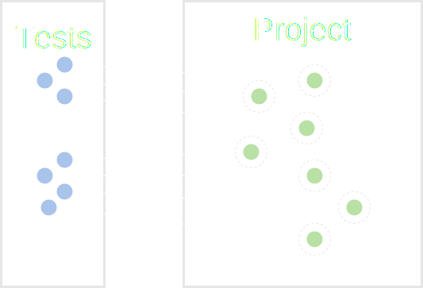
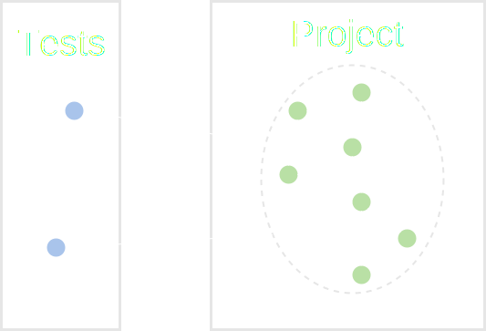
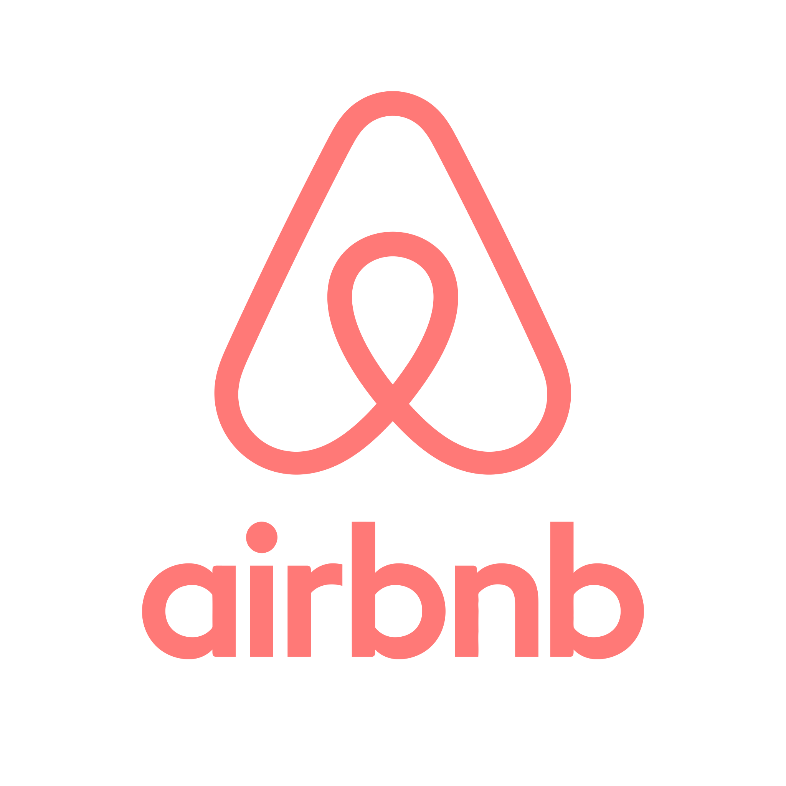
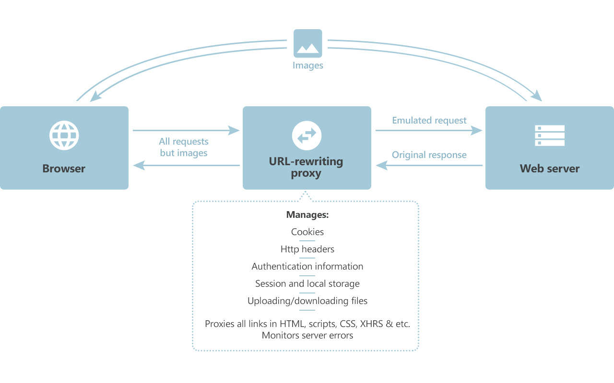
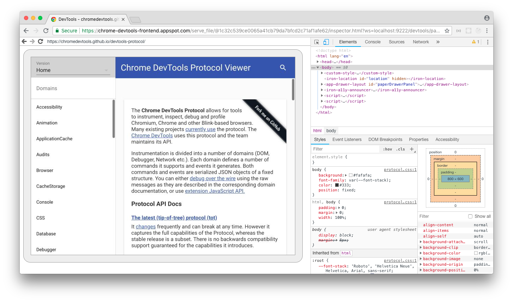
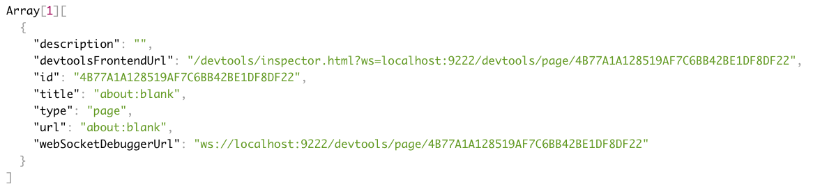
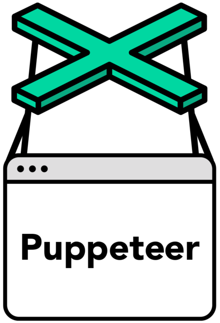

---
revealOptions:
  transition: slide
  controls: false
---


# CLICK THE BUTTON

## The hard way

Дмитрий Лазарев

Note: Меня зовут Дмитрий Лазарев. Сегодня я вам расскажу про то как иногда бывает трудно просто кликнуть по кнопке. Но сначала немного о обо мне.

---

<!-- .element width="100%" -->

Note: Я работаю тим лидом в одной и команд Контура. Возможно вы в курсе что такое Контур и чем мы занимается. Если нет, то Контур занимается разработкой продуктов для электронного документооборота, электронной отчетности и сервисов для предпринимателей и бухгалтеров. Сейчас в Контуре имеется порядка 30 различных продуктов для бизнеса. Наша цель облегчить взаимодействие с государством и сделать работу наших клиентов комфортной. Продукт над которым работает наша команда называется Контур.Экстерн

---

<!-- .element width="100%" -->

Note: Экстерн — основный и самый большой продукт Контура. Основной задачей Экстерна является предоставление удобного сервиса отчетности в контролирующие органы, такие как ФНС, РосСтас, ПФР, ФСС и тд. (Раскрыть?) В разработке Экстерна принимают участие куча команд. Одной из таких команд является команда Формы.

---


Note: Как можно догадаться по названию, команда Форм, занимается формами. Неожиданно, да? На текущий момент у нас реализовано более 300 форм и их кол-во продолжает расти. Может показаться, что у нас много рутины и сплошная бизнес-лапша. Смею вас заверить, что много интересных задач связанных с кодогенерацией, большими объемами и оптимальными авторасчетами. На фронте мы разрабатываем веб версию редактора форм отчетности, предоставляющий пользователю прямо в браузере открыть отчет в удобном и современном интерфейсе. 

---


Note: Так выгляди небольшая часть одной из форм для отчетности декларации по НДС. Но давайте вернемся к теме моего рассказа.

---


Note: Нельзя так просто взять и кликнуть по кнопке, особенно если в тестах хочется делать честные клики, а сами тесты были простые и быстрые. Чтобы лучше представлять в чем заключается проблема, я расскажу немного про тесты, какие они бывают и их особенности. А поможет нам в этом вот этот чувак.

---


Note: Этого чувака зовут Майк Кон. Кто использует у себя в команде скрам или аджайл, возможно знают его. Он является одним из тех кто создал гибкую методологию разработки Scrum, а так же является автором книги про Scrum. В своей книге он рассказывает про концепцию Тестовой пирамиды.

---

## The Test Pyramid


Note: Тестовая пирамида представляет собой метафору, прекрасно иллюстрирующую различные уровни тестирования и то какое кол-во тестов должно быть на каждом уровне. Конечно в реальных проектах разделение всегда несколько сложнее чем это представлено в пирамиде тестов и градация не такая четкая. Но обычно все тесты можно разделить на 3 категории (юнит тесты, интеграционные и end-to-end). При движении вверх по пирамиде растет размер тестов и то кол-во кода, которое может покрыть один тест, вместе с этим растет стоимость поддержки и время выполнения. Рассмотрим каждый из уровней подробнее.

---

## Unit tests TODO



Note: Начнем с самого низа пирамиды, с юнит тестов. Юнит тесты это самый простой вид тестов, который легко ложится в концепцию TDD. Отличительной особенностью этих тестов является то что с помощью них изолированно от всего остального проекта тестируется очень маленький кусочек кода. Примером может служит тест на функцию того что на определенном наборе входных параметров, она должна возвращать конкретнные значения. Или тест на метод класса, при вызове которого, должны просходить вызовы определенных функций с соответствующими аргументами. Из этого всего можно выделить преимущества и недостатки юнит тестов. (Перефразировать про redux)

---

## Unit tests TODO

Плюсы/Минусы

Плюсы:

- Простые, быстрые, стабильные
- TDD, быстрые, стабильные, легко поддерживать

Минусы:

- Низкое покрытие, невозможно протестировать взаимодействие, могут ломаться при рефакторинге
- низкое покрытие, бесполезны после рефакторинга

Note: Простота, переход на интеграционные тесты с взаимодействия

---

## Integration tests


Note: Интеграционные тесты, находятся на следующему уровне пирамиды тестов и отличаются от юнит тестов тем что лишены этого недостатка. Можно сказать, что если юнит тест отвечает на вопрос "Как код должен работать?", то интеграционные тесты в большей степени говорят "Что код должен делать?". То есть, интеграционным тестом может считать такой тест, который проверяет, что при клике на кнопку на сервер уходит запрос. Из этого можно сделать некоторый вывод.

---

## Integration tests TODO

Плюсы/минусы

Плюсы:

- Тестируется взаимодействие
- хорошее покрытие, быстрые, стабильные

Минусы:

- Плохо подходят под TDD, не позволяют тестировать сценарии (переход)
- нет пользовательских сценариев, поддержка чуть сложнее чем Unit

Note: Переход?

---

## End-to-End (E2E) tests



Note: End-to-end тесты взаимодействуют целиком со всем приложением, как если бы с ним взаимодействовал реальный пользователь. Это позволяет тестировать продуктовые сценарии, например для интернет магазина таким сценарием будем: регистрация, выбор товара, добавление его в корзину и оформление доставки. Для таких тестов необходимо разворачивать реальное приложение, инициализировать БД с некоторым набором начальных данных. Это приводит к тому что подготовка окружения занимает значительное время, иногда даже больше чем время выполнения самого теста. Подытожим плюсы и минусы e2e тестов:

---

## End-to-End (E2E) tests TODO

Плюсы/Минусы

Плюсы:

- Пользовательские сценария, большое покрытие
- пользовательские сценарии, огромное покрытие, независят от рефакторинга

Минусы:

- Долгие, сложные в поддержке, нестабильные
- медленные, нестабильные, тяжело поддерживать

Note: Переход?

---

## Итоги

- Честные клики <!-- .element class="fragment" data-fragment-index="1" -->
- Тестирование взаимодействия <!-- .element class="fragment" data-fragment-index="2" -->
- Достаточно быстрые <!-- .element class="fragment" data-fragment-index="3" -->
- Относительно стабильные <!-- .element class="fragment" data-fragment-index="4" -->

Note: Но вернемся к нашей изначальной проблеме. Нам необходимо кликать по кнопке и тестировать некоторое взаимодействие, при этом хотелось не потерять сильно в скорости выполнения тестов, а также обеспечить приемлемый уровень стабильности. Очевидно, что юнит тесты нам не подходят, они не позволяют тестировать взаимодействие. e2e тесты дают нам честные клики и в целом мы можем протестировать взаимодействие, но такие тесты не подходят из-за своей нестабильности и скорости выполнения. Из-за чего нам придется остановить свой выбор на интеграционных тестах, котоыре в большей мере отвечают нашим требованиям. Теперь нам необходимо выбрать инструмент для тестирования, так как в формах мы используем React, то первое что может придти на ум, использовать популярную библиотеку для тестирования React компонентов Enzyme.

---

## Enzyme

 <!-- .element style="width: 55%; float: left;" -->

<!-- .element style="width: 40%; float: left;" -->

http://airbnb.io/enzyme/

Note: Enzyme — это библиотечка от разработчиков компании Airbnb. Enzyme предоставляет удобное API для тестирования React компонентов, позволяет легко протестировать как ведет себя компонент при изменении props/state, вызовы life-cycle методов, разметку.

---

## Enzyme

```typescript
const wrapper = mount(<AwesomeButton />)
wrapper.find('button').simulate('click')
```

```typescript
// Тоже самое что и
wrapper.find('button').prop('onClick')()
```

<!-- .element class="fragment" data-fragment-index="1" -->

```typescript
// Работать не будет
wrapper.simulate('click')
```

<!-- .element class="fragment" data-fragment-index="2" -->

- <!-- .element class="fragment" data-fragment-index="3" --> Нечестные клики, вызов `props.onClick`
- <!-- .element class="fragment" data-fragment-index="3" --> Завязка на внутреннюю разметку

Note: К примеру у нас есть крутая кнопка, со сложной разметкой внутри, некоторой логикой и где-то там внутри есть взаимодействие с APIшкой. И нам хочется протестировать поведение при клике. Чтобы это сделать, нам нужно найти элемент button и эмулировать событие click на данном элементе. Кажется, что всё хорошо, за исключением того, что в тестах появляется знание о внутреней разметке компонента. Но, на самом деле вызов simulate('click') ничто иное, как просто вызов функции onClick из props нашей кнопки, именно так работает подкапотом enzyme по словам авторов, в следующей версии они планируют удалить метод simulate, за его неявное поведение. В результате мы имеем, нечестные клики и завязку на внутрености компонента. К сожаление, оба этих пункта не дают нам использовать enzyme в наших тестах. Попробуем на этот раз взять TestCafe.

---

 <!-- .element style="background: #fff; padding: 20px" -->

http://devexpress.github.io/testcafe/

Note: TestCafe — это инструмент на nodejs, позволяющий автоматизировать e2e тестирование. Основными фишками testcafe, можно назвать: быстрый старт и отсутствие необходимости в WebDriver'е, большую стабильность тестов засчет умных тайм-аутов и поддержку TypeScript'а. Благодаря тому что  testcafe позиционирует себя как инструмент для e2e тестирования, мы можем ожидать, выполнения как минимум одного из пунктов, а именно честных кликов. Попробуем написать простой тест.

---

## TestCafe

```typescript
fixture `AwesomeButton`
	.page `http://localhost:3000/awesome-button`

test('Click the button', async t => {
    await t.click('[data-prop-tid=button]')
    // ...
})
```

Note: Выглядит достаточно лаконично. В начале объявляем название для группы тестов и говорим, что страничка, которую мы хотим тестировать находится по такому урлу. Здесь я специально не буду приводить пример кода серверной части, просто имейте в виду, что поэтому урлу отдается простой html и рисуется наша крутая кнопка. Дальше по коду описываются сами тесты. Можно заметить, что первым аргументом в функцию теста приходит некое t, здесь это тестовый контроллер, объект, предоставляющий удобное API для взаимодействия со страницей, обработку эвентов и выполнения проверок. Попробуем теперь усложнить пример и реализовать тест, проверяющий взаимодействия нашей кнопки с приложением. 

---

## TestCafe

```typescript
import { ClientFunction } from 'testcafe'

const getClickValue = ClientFunction(
    () => window.getInternalData())

fixture `AwesomeButton`
	.page `http://localhost:3000/awesome-button`

test('Click the button', async t => {    
    await t.click('[data-prop-tid=button]')
    
    const expectedValue = { /* ... */ }
    const receivedValue = await getClickValue()
    await t.expect(receivedValue).eql(expectedValue)
})
```

- <!-- .element class="fragment" data-fragment-index="1" --> Сложно тестировать взаимодействие

Note: Для этого воспользуемся такой штукой, как ClientFunctions. ClientFunctions позволяет объявить функцию и выполнить её на стороне клиента, а также вернуть любое сериализуемое значение обратно на сервер. Здесь у нас на клиенте вызывается некая глобальная функция getInternalData. Её необходимо объявить в скрипте, который отдается вместе с тестируемой страницей. Проще говоря, в тестах нам нужно выставлять кишки приложения наружу, чтобы протестировать взаимодействие. В реальности, при увеличении тестов, кол-во хелперов растет линейно, а это приводит к увеличению поддерживаемого кода. Кроме того, для каждого тестируемого компонента необходимо фомировать свою отдельную страницу. Всё это приводит к сложности при тестировании взаимодействия. И мы пока не готовы платить такую цену за возможность делать честные клики. Но прежде чем перейти к следующему подходу, я расскажу ещё немного о том как устроен testcafe.

---



Note: Как я уже говорил, для использования TestCafe вам не нужен WebDriver, чтобы взаимодействовать с браузером. Вместо него TestCafe использует URL-Rewriting Proxy. Прокси инжектит свой скрипт, который позволяет эмулировать пользовательские действия и выполнять код на стороне клиента. Иначе говоря для эмуляции используется обычный DOM Events API, в чем можно легко убедится подсмотрев исходники. Это наталкивает на мысль о том, что мы сами можем попробовать использовать DOM Events чтобы кликнуть по кнопке.

---

## DOM Events

```typescript
const button = document
    .querySelector('[data-prop-tid=button]')
button.querySelector('button').click()

// Или
const event = new MouseEvent('click')
button.querySelector('button').dispatchEvent(event)
```

```typescript
const {x, y, width, height} = button.getBoundingClientRect()
const realButton = document
	.elementFromPoint(x + width / 2, y + height / 2)
```

<!-- .element class="fragment" data-fragment-index="2" -->

- <!-- .element class="fragment" data-fragment-index="1" --> Завязка на внутреннюю разметку

Note: В самом простом случае клик выглядит вот таким образом. Тут можно заметить, что мы как и в случае с Enzyme завязаны на внутреннюю разметку компонента, но в то же время можем делать более-менее честные клики. В TestCafe эта проблема каким-то образом решена, я не стал копать дальше и решил попробовать несколько другой подход. Но когда готовил презентацию я выяснил, что на самом деле можно получить реальную кнопку просто взяв элемент по определенным координатам с помощью elementFromPoint. И всё же я хотел бы рассказать о том решении на котором я в конечном итоге остановился. Другой подход начался с использования Chrome DevTools Protocol.

---

## Chrome DevTools Protocol


https://chromedevtools.github.io/devtools-protocol/

Note: CDP — это низкоуровневое API для управления браузеров Chrome и ему подобных, построеное поверх вебсокетов. Позволяет делать множество интересных вещей с браузером, инспектировать и взаимодействовать с DOM, отлаживать скрипты, заниматься профилированием, работать с сетью, а так же эмулировать пользовательские действия. Сами devtools браузера используют этот протокол чтобы взаимодействовать со страницей. Попробуем воспользоваться.

---

## Chrome DevTools Protocol

```bash
chrome --remote-debugging-port=9222
open http://localhost:9222
```

<!-- .element class="fragment" data-fragment-index="1" -->

 <!-- .element class="fragment" data-fragment-index="2" width="80%" -->

Note: Чтобы иметь возможность удаленно подключится к браузеру, необходимо запустить хром с флагом remote-debugging-port. После этого, если перейти по ссылке можно увидеть веб интерфейс работы с ChromeDevTools. В нашем случае, мы хотим подключится программно, для этого необходимо получить websocket url страницы с которой хотим работать. Для этого в конец ссылки надо добавить json и в ответе мы получим массив страниц открытых на данный момент в браузере.

---



---

```typescript
const ws = new WebSocket(
    `ws://localhost:9222/devtools/page/${PageId}`)
const send = data =>
	ws.send(JSON.stringify({ id: uuid(), ...data }))
```

<!-- .element class="fragment" data-fragment-index="1" -->

```typescript
send({method: 'DOM.getDocument', params: {}})
send({
    method: 'DOM.querySelector',
    params: {nodeId: 1, selector: '[data-prop-tid=button]'}})
```

<!-- .element class="fragment" data-fragment-index="2" -->

```typescript
send({method: 'DOM.getBoxModel', params: { nodeId: 23 }})
send({
    method: 'Input.dispatchMouseEvent',
    params: { type: 'mousePressed', x: 40, y: 357,
               button: 'left', clickCount: 1 }})
send({
    method: 'Input.dispatchMouseEvent',
    params: { type: 'mouseReleased', x: 40, y: 357,
             button: 'left', clickCount: 1 }})
```

<!-- .element class="fragment" data-fragment-index="3" -->

Note: У нас выходит что-то такое. В первой строке мы подключаемся по вебсокетам для того чтобы взаимодействовать с определенной страницей (под страницей может выступать вкладка, devtools браузера, экстеншоны). Далее мы получаем nodeId документа, тут нам повезло и документ имеет nodeId: 1. После этого применяем селектор, который нам возвращает nodeId найденного элемента. После этого запрашиваем BoxModel для этого элемента и получаем размеры и координаты кнопки. Две последние команды нажимают/отпускают левую кнопку мыши по координатам внутри кнопки. Как видно, получается очень громоздко. И вместо того чтобы писать свою обертку воспользуемся уже готовой библиотекой.

---



<!-- .element style="background: #fff; width: 40%; padding: 20px; display: inline-block" -->

Note: На самом деле существует достаточно много реализаций высокоуровнего API над CDP. Я выбрал Puppeteer из-за того что он предоставляет очень удобное API для работы с DOM.

---

## Puppeteer

- Хорошее и удобное API, но...
- Не работает в браузере из коробки

Note: Единственным недостатком в нашем случае является то что Puppeteer работает только в nodejs окружении. Нам же необходимо уметь работать с puppeteer из браузера. Поэтому напишем свою небольшую инициализацию.

---

```typescript
const response =
    await fetch('http://localhost:9222/json/version')
const data = await response.json()
// Ответ в json
```

```typescript
import { Connection } from 'puppeteer/lib/Connection'
import Browser from 'puppeteer/lib/Browser'

const connection = await Connection
	.createForWebSocket(data.webSocketDebuggerUrl)
const browser = await Browser
    .create(connection, { appMode: true })
const pages = await browser.pages()
```

```typescript
// Disables network tracking,
// prevents network events from being sent to the client
// NOTE Because we don't want crash browser under events flood
pages.forEach(p => p._client.send('Network.disable', {}))
```

Note: Тут мы получаем вебсокет урл для подключения. Подключаемся и запрашиваем доступные на данный момент странички. И в конце для каждой странички отключаем обработку сетевых событий. Тут хотелось бы пояснить, для чего это нужно. Как изначально я говорил, наша задача писать интеграционные тесты, а это значит, что код тестов выполняется на странице в браузере. Что в свою очередь ведет к тому что подключаться к браузеру необходимо со страницы самого браузера, чтобы управлять браузером находясь в браузере. Взрыв мозга. Но так как мы должны работать с определенной страницей, нам каким-то образом нужно выяснить какая страница относится к текущей вкладке в которой мы сейчас находимся.

Пояснить что за урл. Пояснить про инстанс (быть готовым). Разбить на слайды

---

```typescript
const page = await new Promise(resolve => {
  const expectedGuid = uuid()
  const findCurrentPage = index => async msg => {
    if (msg.type() != 'debug') return
    const [firstArg] = msg.args()
    const receivedGuid = await firstArg.jsonValue()
    if (receivedGuid == expectedGuid) {
      pages[index].removeAllListeners('console')
      resolve(pages[index])
    }
  }
  pages.forEach((p, index) =>
                p.on('console', findCurrentPage(index)))
  console.debug(expectedGuid)
})
```

Note:

---

```typescript
it('Should dispatch action with value', async () => {
  const { form } = render(
      <DatePicker path={'a/b'} tid={'datepicker'} />)
  const selector = '[data-prop-tid=datepicker]'
  await devtools.click(selector)
  await devtools.type(selector, '23102018')
  await devtools.mouse.click(0, 0)
  
  expect(form.store.dispatch)
    .to.have.been.calledWithExactly({
      type: UPDATE_MODEL,
      payload: { path: 'a/b', field: 'value',
        value: '23.10.2018' },
    })
})
```

Note: Пример теста. Код. Повторить пробему

---

Фотка, ФИО, рабочее мыло

