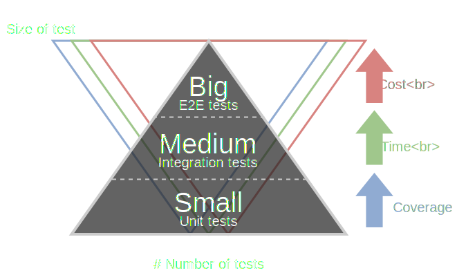

---
revealOptions:
  transition: slide
---


# CLICK THE BUTTON

## The hard way

Note: Представиться. Рассказ про команду (Экстерн, сервис отчетности, формы). Вступительное слово (Насколько трудно кликнуть по кнопке, в тестах)

---

## The Test Pyramid



Note: Какие тесты бывают (Unit, Integration, E2E). Unit — Плюсы: TDD, быстрые, стабильные, легко поддерживать. Минусы: низкое покрытие, бесполезны после рефакторинга. E2E — Плюсы: пользовательские сценарии, огромное покрытие, независят от рефакторинга. Минусы: медленные, нестабильные, тяжело поддерживать. Integration — Плюсы: хорошее покрытие, быстрые, стабильные. Минусы: нет пользовательских сценариев, поддержка чуть сложнее чем Unit. Почему именно Integration. Много сгенерированных форм, тяжело поддерживать столько E2E тестов, медленные. Unit тесты не дают достаточного уровня покрытия. Золотая середина

---

<iframe width="853" height="480" data-src="https://www.youtube.com/embed/0GypdsJulKE?autoplay=1&controls=0&loop=1&playlist=0GypdsJulKE&showinfo=0"></iframe>

Note: Итак. Нам нужны интеграционные тесты на работу компонента/ов внутри формы. Так как мы используем React, то первое что может придти на ум, использовать популярную библиотеку для тестирования React компонентов Enzyme. Enzyme — это такая прикольная штука, которая существенно упрощает написание Unit тестов на компоненты, позволяет легко протестировать как ведет себя компонент при изменении props/state, вызовы life-cycle методов, разметку.

---

## Enzyme

```typescript
it('Click the button', () => {
    const wrapper = mount(<AwesomeButton />)
	wrapper.find('button').simulate('click')
	// Тоже самое что и
	wrapper.find('button').prop('onClick')()

	// Работать не будет
	// wrapper.simulate('click')
    
    // ...
})
```

- Не честные клики, вызов `props.onClick`
- Завязка на внутреннюю разметку

Note: В каких случаях это плохо. Возьмем для примера DatePicker, компонент чуть более сложный, чем простой input. Внутри себя рисует input, передает ему в onChange свой обработчик, который в свою каким-то образом форматирует/парсит пользовательский ввод (позволяет вводить дату без точек) и вызывает onChange из props с модифицированным значением. Так вот simulate('change') ничто иное, как просто вызов onChange из props нашего DatePicker. Если нам нужно протестировать внутренний обработчик, то нам сначала нужно найти тот input и уже у него вызывать onChange. Попробуем зайти с другой стороны и возьмем уже инструмент для E2E тестирования, а именно TestCafe.

---

## TestCafe

```typescript
test('Click the button', async t => {
    await t.click('[data-prop-tid=button]')
    // ...
})
```

- Удобная штука для e2e тестов
- Можно инжектить код на клиент
- Мокать и навешивать spy, слишком сложно

Note: Штука достаточно удобная. Поддержка TypeScript'а, возможность использовать async/await, быстрый старт. Приятное API и встроенные ассерты. А самое главное, так как это инструмент для e2e тестов, честные клики. TestCafe в отличии от Selenium используется URL-Rewriting proxy. Это прокси инжектит специальные скрипты, которые эмулируют пользовательские действия. Но как и Selenium, писать интеграционные тесты с его помощью достаточно сложно. В виду того что нам необходимо проверять то как компонент взаимодействует с формой, а не форму целиком. Так как TestCafe внутри себя содержит скрипты позволяющие эмулировать пользовательские действия, почему бы нам не попробовать самим сделать что-то подобное с помощью DOM Events.

---

## DOM Events

```typescript
it('Click the button', () => {
    const button = document
    	.querySelector('[data-prop-tid=button]')
    button.querySelector('button').click()
    // Или
    const event = new MouseEvent('click')
    button.querySelector('button').dispatchEvent(event)
    
    // ...
})
```

- Всплытие и tid навешивается на label
- Завязка на внутреннюю разметку

Note: Тут всё достаточно понятно. Более-менее честные клики, нет сложностей в написании интеграционных тестов, но нам снова как и с Enzyme приходится завязываться на внутренюю разметку компонентов. Кажется что выхода нет и мы вынуждены будем или писать кучу E2E тестов, которые будет больно поддерживать, они будут очень долго ходить и постоянно падать или полагаясь на unit тесты надеятся, что в результате очередного рефакторинга мы ничего не забыли и все модули правильно используют внутренее API друг друга. Но на самом деле не всё так плохо. Выход есть, и он называется Chrome DevTools Protocol

---

## Chrome DevTools Protocol

Решение в лоб

Note: Что это такое?

---

```typescript
const ws = new WebSocket(
    `ws://localhost:9222/devtools/page/${PageId}`)
const send = data =>
	ws.send(JSON.stringify({ id: uuid(), ...data }))
```

```typescript
send({method: 'DOM.getDocument', params: {}})
send({
    method: 'DOM.querySelector',
    params: {nodeId: 1, selector: '[data-prop-tid=button]'}})
```

```typescript
send({method: 'DOM.getBoxModel', params: { nodeId: 23 }})
send({
    method: 'Input.dispatchMouseEvent',
    params: { type: 'mousePressed', x: 40, y: 357,
               button: 'left', clickCount: 1 }})
send({
    method: 'Input.dispatchMouseEvent',
    params: { type: 'mouseReleased', x: 40, y: 357,
             button: 'left', clickCount: 1 }})
```

---

## Puppeteer 

- Хорошее и удобное API, но...
- Не работает в браузере из коробки

Note: Что это такое?

---

## attachDevTools

```typescript
import { Connection } from 'puppeteer/lib/Connection'
import Browser from 'puppeteer/lib/Browser'
```

```typescript
const response =
    await fetch('http://localhost:9222/json/version')
const data = await response.json()
```

```typescript
const connection = await Connection
	.createForWebSocket(data.webSocketDebuggerUrl)
const browser = await Browser
    .create(connection, { appMode: true })
const pages = await browser.pages()
```

```typescript
// Disables network tracking,
// prevents network events from being sent to the client
// NOTE Because we don't want crash browser under events flood
pages.forEach(p => p._client.send('Network.disable', {}))
```

---

```typescript
const page = await new Promise(resolve => {
  const expectedGuid = uuid()
  const findCurrentPage = index => async msg => {
    if (msg.type() != 'debug') return
    const [firstArg] = msg.args()
    const receivedGuid = await firstArg.jsonValue()
    if (receivedGuid == expectedGuid) {
      pages[index].removeAllListeners('console')
      resolve(pages[index])
    }
  }
  pages.forEach((p, index) =>
                p.on('console', findCurrentPage(index)))
  console.debug(expectedGuid)
})
```

---

## PROFIT

- Удобное API
- Честные клики и не только
- Работает только в хроме

---

## Bonus

```typescript
const promiseHandler = {
  apply(target, _thisArg, args) {
    return target().then(func => func(...args))
  },
  get(target, prop) {
    return new Proxy(() => target()
      .then(obj => obj[prop]), promiseHandler)
  },
}

const devtools = new Proxy(() => attachDevTools(),
                           promiseHandler)
```

---

```typescript
it('Should dispatch action with value', async () => {
  const { form } = render(
      <DatePicker path={'a/b'} tid={'datepicker'} />)
  const selector = '[data-prop-tid=datepicker]'
  await devtools.click(selector)
  await devtools.type(selector, '23102018')
  await devtools.mouse.click(0, 0)
  
  expect(form.store.dispatch)
    .to.have.been.calledWithExactly({
      type: UPDATE_MODEL,
      payload: { path: 'a/b', field: 'value',
        value: '23.10.2018' },
    })
})
```

---

## The End

\*TODO* QR, ссылки

https://martinfowler.com/bliki/TestPyramid.html

https://www.youtube.com/watch?v=0GypdsJulKE

Note: Вопросы. Почему button обернут в label — издержки ИЕ8, сейчас скорее всего это уже не нужно, надо проверять. Другой пример combobox, где input отображается в режиме редактирования. Необходимо для того чтобы рисовать значение состоящие из двух полей: код и наименование. data-prop атрибуты