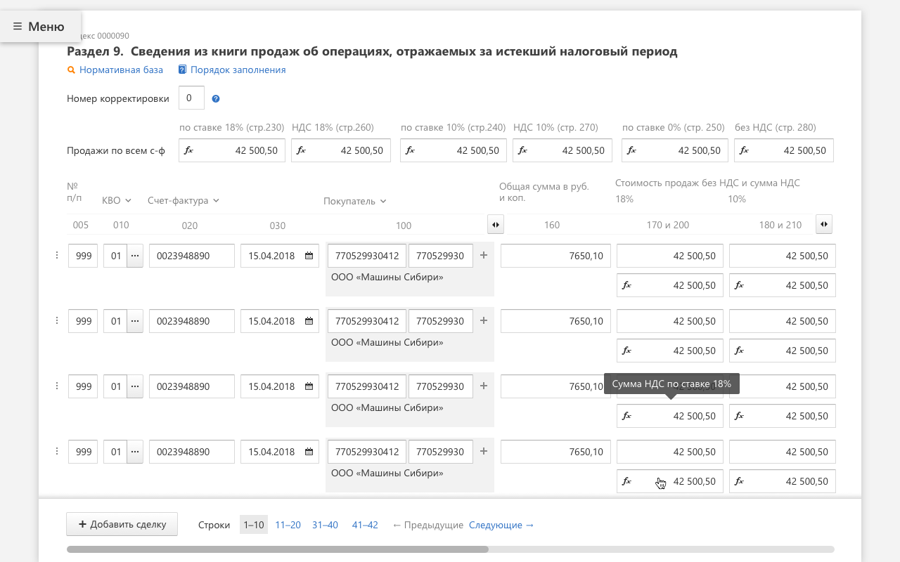
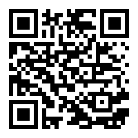

---
revealOptions:
  transition: slide
  controls: false
---


<br /><br />

# CLICK THE BUTTON

## The hard way

<br /><br />

<sub>Дмитрий Лазарев</sub>

Note: Меня зовут Дмитрий Лазарев. Сегодня я вам расскажу про то как иногда бывает трудно кликнуть по кнопке. И поделюсь своей историей того с чем мне пришлось столкнутся, когда понадобилось написать тест, который просто делает честный клик. Но перед этим пара слов про проект.

---


Note: Я работаю в команде Формы контру.экстерна. Как можно догадаться по названию мы делаем формы. Но как и все нормальные разработчики, нам лень заниматься такой рутинной работой, поэтому мы занимается кодогенерацией. Пишем код, который делает формы за нас. В основном это формы отчетности в контролирующие органы: ФНС, РосСтат, ПФР и тд.

---



Note: Вот так например выглядит часть формы отчетности по НДС.

---


Note: И так, как я уже говорил, нельзя просто так взять и кликнуть по кнопке, особенно в тестах и тем более если хочется делать честные клики. Вы спросите почему? И чтобы ответить на этот вопрос мы обратимся к вот этому чуваку

---


Note: Кто-нибудь знает кто это такой? Пауза. Его зовут Майк Кон, автор книги Гибкая методология разработки Scrum. В своей книге он описывает концепт тестовой пирамиды.

---

## The Test Pyramid


Note: Тестовая пирамида прекрасно иллюстрирует категории тестов и их особенности. При движении вверх по пирамиде можно увидеть, что растет не только размер теста и покрываемое им кол-во кода, но также растет стоимость поддержки и время выполнения. Поэтому важно правильно выбрать подходящий под требования уровень.

---

## Требования к тестам

- Честные клики <!-- .element class="fragment" data-fragment-index="1" -->
- Тестирование взаимодействия <!-- .element class="fragment" data-fragment-index="2" -->
- Оптимальное время выполнения <!-- .element class="fragment" data-fragment-index="3" -->
- Стабильность <!-- .element class="fragment" data-fragment-index="4" -->

Note: Чего же мы хотим от тестов? Честные клики, как же без них, под честными кликами я подразумеваю любое пользовательское действие. Тестирование взаимодействия. Мы хотим тестировать взаимодействие частей приложения между собой, а не всё приложение целиком. Оптимальное время выполнения. Ну кто не хочет чтобы его тесты проходили быстро. Стабильность. И конечно же не хочется, чтобы тест падал в зависимости от фазы луны или дня недели. Отсюда можно сделать вывод, что больше всего нам подходят интеграционные тесты. E2E тесты слишком медленные и нестабильные. А юнит тесты...

---

## 2 unit tests, 0 integration tests


Note: Потому что это юнит тесты. С помощью них нельзя протестировать взаимодействие. Давайте напишем такие тесты на нашу офигенско крутую кнопку.

---

## TODO Картинка с кнопкой

Note: Будем считать, что AwesomeButton это типичный React компонент в проекте. Она содержит кучу сложной верстки, бизнес-лапшу в методах. И где-то там внутри есть кнопка, по которой мы хотим кликать. Попробуем сделать это использовав Enzyme.

---

## Enzyme

 <!-- .element style="width: 55%; float: left;" -->

<!-- .element style="width: 40%; float: left;" -->

https://airbnb.io/enzyme/

Note: Enzyme (произношение?) — это библиотека для тестирования React компонентов от Airbnb. Кто-нибудь использует Enzyme? Пауза. Enzyme/Он предоставляет удобное API для взаимодействия с тестируемым компонентом, позволяет проверить его поведение при изменении props или state, а также вызовы life-cycle методов и правильность разметки.

---

## Enzyme

```typescript
import { mount } from 'enzyme'

const wrapper = mount(<AwesomeButton />)
wrapper.find('button').simulate('click')
```

```typescript
// Тоже самое что и
wrapper.find('button').prop('onClick')()
```

<!-- .element class="fragment" data-fragment-index="1" -->

```typescript
// Работать не будет
wrapper.simulate('click')
```

<!-- .element class="fragment" data-fragment-index="2" -->

- <!-- .element class="fragment" data-fragment-index="3" --> Нечестные клики, вызов `props.onClick`
- <!-- .element class="fragment" data-fragment-index="3" --> Завязка на внутреннюю разметку

Note: Чтобы кликнуть по нашей кнопке, для начала нужно отрендерить её. Функция mount отрисовывает кнопку, как если бы она отрисовывалась прямо в браузере с помощью ReactDOM.render. Результатом mount будет объект wrapper с хелпер методами. Далее мы находим элемент button и эмулируем событие click. Вроде всё хорошо, но есть две проблемы. Первая это знание о внутреней разметке компонента. И вторая simulate('click') ничто иное, как просто вызов функция onClick из props нашей кнопки. Именно так работает enzyme под капотом. И именно поэтому simulate('click') на враппере не сработает, так как в AwesomeButton мы не передаем никаких props. В результате мы получили, нечестные клики и завязку на внутрености компонента. Enzyme не подходит под наши требования. Попробуем взять TestCafe.

---

 <!-- .element style="background: #fff; padding: 20px" -->

https://devexpress.github.io/testcafe/

Note: TestCafe — это аналог selenium'а для e2e тестов, он проще в использовании и не требует установки WebDriver'а. Имеет механизм умных тайм-аутов и поддержку TypeScript'а из коробки. Давайте напишем простой тест, который кликает по нашей кнопке.

---

## TestCafe

```typescript
fixture `AwesomeButton Tests`
	.page `http://localhost:3000/awesome-button`

test('Click the button', async t => {
    await t.click('[data-comp-name=AwesomeButton]')
    // ...
})
```

Note: В начале мы объявляем название для группы тестов и страничку на которой будет отрисовываться наша кнопка. Далее сам тесткейс, где в колбеке принимаем тестовый контроллер, объект для взаимодействия со страницей. Выглядит неплохо. Усложним пример.

---

## TestCafe

```typescript
import { ClientFunction } from 'testcafe'

const getInternalMethodArgs = ClientFunction(() => {
    // Возвращаем информацию о вызове внутреннего метода
    return window.wasInternalMethodCalledWithArgs()
})

fixture `AwesomeButton Tests`
	.page `http://localhost:3000/awesome-button`

test('Click the button', async t => {
    await t.click('[data-comp-name=AwesomeButton]')

    const expectedArgs = [ /* ... */ ]
    const receivedArgs = await getInternalMethodArgs()

    await t.expect(receivedArgs).eql(expectedArgs)
})
```

Note: Код теста выполняется в nodejs окружении. Для тестирования взаимодействия нужно получать информацию о вызове метода приложения из браузера. Для этого мы можем написать глобальную хелпер функцию, возвращающую эту информацию. Колбек переданный в ClientFunction выполнится на стороне браузера и вернет результат выполнения в тест, где мы его проверим. В принципе с этим можно жить, но только если вы готовы написать кучу хелпер методов, подготовить под каждый компонент свою страничку и возможно даже не одну. Я не готов, поэтому идем дальше. Но прежде, ещё пару слов про TestCafe.

---

## TestCafe

 <!-- .element style="width: 80%; background: #fff; padding: 0 40px" -->

Note: Как я уже говорил, TestCafe в отличии от Selenium не требует установка WebDriver'а. Внутри себя он использует URL-Rewriting Proxy, с помощью которого на страницу инжектятся скрипты, позволяющие эмулировать пользовательские действия. Для это используется обычное DOM Events API. Вот его-то мы и заиспользуем.

---

## DOM Events

```typescript
const selector = '[data-comp-name=AwesomeButton]'
const button = document.querySelector(selector)
button.querySelector('button').click()

// Или
const event = new MouseEvent('click', { /* ... */ })
button.querySelector('button').dispatchEvent(event)
```

<!-- .element class="fragment" data-fragment-index="1" -->

```typescript
const {x, y, width, height} = button.getBoundingClientRect()
const realButton = document
	// Надеемся, что кнопка где-то в середине :)
	.elementFromPoint(x + width / 2, y + height / 2)
```

<!-- .element class="fragment" data-fragment-index="3" -->

- <!-- .element class="fragment" data-fragment-index="2" --> Завязка на внутреннюю разметку

Note: Как мы уже знаем, наш компонент содержит много сложной верстки. И как в случае с Enzyme нам приходится искать элемент button по которому нужно кликать. Я не стал раскапывать то, как в TestCafe решили эту проблему и использовал другой подход. Но когда я готовился к конференции я нашел способ её решить с помощью elementFromPoint, пускай получилось немного костыльно, но зато это работает. А сейчас я расскажу о решении на котором я остановился. Оно появилось при попытке использовать Chrome DevTools Protocol.

---

## Chrome DevTools Protocol


https://chromedevtools.github.io/devtools-protocol/

Note: Кто-нибудь знает что это такое? Пауза. CDP — это низкоуровневое API для управления браузером Chrome. Оно позволяет делать множество интересных вещей с браузером. Например взаимодействовать с DOM, отлаживать скрипты, заниматься профилированием, работать с сетью, но главное эмулировать пользовательские действия. Попробуем воспользоваться.

---

## Chrome DevTools Protocol

```bash
chrome --remote-debugging-port=9222
open http://localhost:9222
```

<!-- .element class="fragment" data-fragment-index="1" -->

 <!-- .element class="fragment" data-fragment-index="2" width="80%" -->

Note: Для этого надо запустить хром в режиме отладки с флагом remote-debugging-port. После этого зайти на локалхост по этому порту и перейти по одной из ссылок. Мы увидим вот такое веб приложение. Но чтобы подключится программно, нам нужно получить websocket url. Для этого добавим в конце /json, в ответ мы получим массив объектов каждый из которых представляет открытую вкладку и содержит нужный нам урл.

---

```typescript
const ws = new WebSocket(
    `ws://localhost:9222/devtools/page/${PageId}`)
const send = data =>
	ws.send(JSON.stringify({ id: uuid(), ...data }))
```

```typescript
send({method: 'DOM.getDocument', params: {}}) // nodeId: 1
```

<!-- .element class="fragment" data-fragment-index="1" -->

```typescript
const selector = '[data-comp-name=AwesomeButton]'
send({
    method: 'DOM.querySelector',
    params: {nodeId: 1, selector}}) // nodeId: 23
```

<!-- .element class="fragment" data-fragment-index="2" -->

```typescript
send({method: 'DOM.getBoxModel', params: { nodeId: 23 }})
```

<!-- .element class="fragment" data-fragment-index="3" -->

```typescript
send({
    method: 'Input.dispatchMouseEvent',
    params: { type: 'mousePressed', x: 40, y: 357,
               button: 'left', clickCount: 1 }})
send({
    method: 'Input.dispatchMouseEvent',
    params: { type: 'mouseReleased', x: 40, y: 357,
             button: 'left', clickCount: 1 }})
```

<!-- .element class="fragment" data-fragment-index="4" -->

Note: Вида /devtools/page и некий pageId. После того как мы подключились, нам нужно найти нашу крутую кнопку. Для этого получим nodeId документа и выполним на нем querySelector. Чтобы сделать клик, нам нужны координаты кнопки. Вычислить их можно получив блочную модель элемента. Для клика нажмем и отпустим левую кнопку мыши ровно один раз по этим координатам. Я честно говоря не проверял, что произойдет, если установить clickCount больше единицы, кому интересно, можете попробовать на досуге. Получилось довольно много кода на такое простое действие, но к счастью уже есть куча библиотек которые облегчают работу с CDP. Одна из них Puppeteer

---


<!-- .element style="background: #fff; width: 35%; padding: 0 20px; display: inline-block" -->

https://pptr.dev/

Note: Кто знаком с папитиром? Пауза. Puppeteer — переводится как кукольник и представляет удобную абстракцию для управления браузером. Для нас единственный недостатком является то что он работает только в nodejs окружении. А мы хотим использовать его в браузере. Для этого напишем немного кода.

---

```typescript
import { Connection } from 'puppeteer/lib/Connection'
import Browser from 'puppeteer/lib/Browser'

// ...

const connection = await Connection
	.createForWebSocket(webSocketDebuggerUrl)
const browser = await Browser
    .create(connection, { appMode: true })
const pages = await browser.pages()
```

```typescript
pages.forEach(p => p._client.send('Network.disable', {}))
```

<!-- .element class="fragment" data-fragment-index="1" -->

Note: Подключимся по вебсокетам и запросим доступные на данный момент вкладки. В конце для каждой вкладки надо отключить отправку сетевых событий. Для чего это нужно? Потому что мы подключаемся к браузеру из самого браузера, чтобы управлять этим браузером из браузера.

---


Note: У нас в браузере может быть открыто много вкладок и чтобы выяснить с какой вкладкой нам необходимо работать, нужно применить немного консольной магии

---

```typescript
const page = await new Promise(resolve => {
  const expectedGuid = uuid()
  const findCurrentPage = index => async msg => {
    const receivedGuid = await msg.args()[0].jsonValue()
    if (receivedGuid == expectedGuid) {
      resolve(pages[index])
    }
  }
  pages.forEach((p, index) =>
                p.on('console', findCurrentPage(index)))
  console.debug(expectedGuid)
})
```

Note: Для этого подпишемся на события консоли для каждой вкладки. После этого сгенерируем гуид и выведем его в консоль. Нам нужна та вкладка в которой сообщение в консоли будет равно нашему гуиду. Это дает возможность использовать puppeteer в наших браузерных тестах. Напишем сам тест

---

```jsx
it('Click the button', async () => {
  const container = document.getElementById('root')
  const form = new FakeForm({ /* ... */ })

  ReactDOM.render(
    <FormProvider value={form}>
      <AwesomeButton />
    </FormProvider>,
    container
  )

  await page.click('[data-comp-name=AwesomeButton]')

  expect(form.module.doSomething)
    .to.have.been.calledWithExactly({ /* ... */ })
})
```

Note: И так что мы получили. Честные клики, достигающиеся с помощью CDP. Тестирование взаимодействия. Быстрота и стабильность обеспечиваются тем что нам не нужно инициализировать всё приложение целиком, мы рендерим только кнопку и никакое окружение не влияет на тест. Крутые тесты на крутую кнопку

---



Лазарев Дмитрий

[@wKich](https://t.me/wKich)

[dmitry.lazarev@skbkontur.ru](mailto://dmitry.lazarev@skbkontur.ru)
