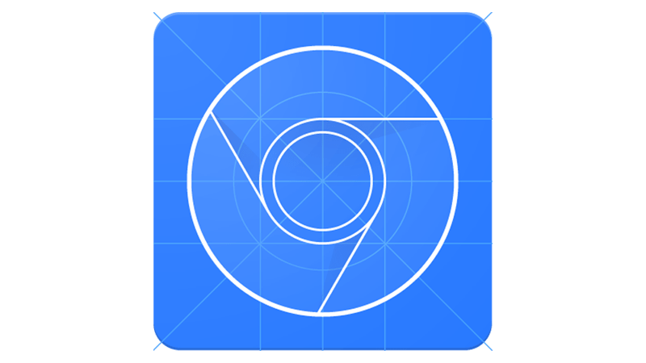

---
revealOptions:
  transition: slide
  controls: false
---


# CLICK THE BUTTON

## The hard way

Дмитрий Лазарев

Note: Меня зовут Дмитрий Лазарев. Сегодня я вам расскажу про то как иногда бывает трудно просто кликнуть по кнопке. Но перед этим пара слов про проект.

---


Note: Я работаю в команде Формы контру.экстерна. Как можно догадаться по названию мы делаем формы. Но как и все нормальные разработчики, нам лень заниматься такой рутинной работой, поэтому мы занимается кодогенерацией. Пишем код, который делает формы за нас. В основном это формы отчетности в контролирующие органы: ФНС, РосСтат, ПФР и тд.

---


Note: Вот так например выглядит часть формы отчетности по НДС.

---


Note: И так, как я уже говорил, нельзя просто так взять и кликнуть по кнопке, особенно в тестах и тем более если хочется делать честные клики. Вы спросите почему? И чтобы ответить на этот вопрос мы обратимся к вот этому чуваку

---


Note: Кто-нибудь знает кто это такой? Пауза. Его зовут Майк Кон, автор книги Гибкая методология разработки Scrum. В своей книге он описывает концепт тестовой пирамиды.

---

## The Test Pyramid


Note: Тестовая пирамида прекрасно иллюстрирует категории тестов, их особенности и соотношение этих тестов в рамках проекта. При движении вверх по пирамиде можно увидеть, что растет не только размер теста и покрываемое им кол-во кода, но также растет стоимость поддержки и время выполнения. Поэтому правильно выбрать подходящий для наших требований уровень.

---

## Требования к тестам

- Честные клики <!-- .element class="fragment" data-fragment-index="1" -->
- Тестирование взаимодействия <!-- .element class="fragment" data-fragment-index="2" -->
- Достаточно быстрые <!-- .element class="fragment" data-fragment-index="3" -->
- Относительно стабильные <!-- .element class="fragment" data-fragment-index="4" -->

Note: Чего же мы хотим от тестов? Ну, в первую очередь нам нужны честные клики, под честными кликами я подразумеваю любое пользовательское действие. Далее мы хотим тестировать взаимодействие компонента с приложением, а не всё приложение целиком. Кроме этого было бы замечательно обеспечить оптимальную скорость выполнения тестов. Ну и конечно не стоит забывать о том, чтобы тест не падал от фазы луны или дня недели. Отсюда можно сделать вывод, что оптимальным вариантом для нас будут интеграционные тесты. E2E тесты нам не подходят из-за своей медлительности и нестабильности. А юнит тесты...

---

## 2 unit tests, 0 integration tests


Note: Потому что это юнит тесты. С помощью них нельзя протестировать взаимодействие. В качестве подопытного для наши тестов возьмем мега-крутую кнопку.

---

TODO Картинка с кнопкой

Note: Будем считать, что AwesomeButton это типичный React компонент в нашем гипотетическом проекте. Представляет из себя учебник по антипаттернам, куча сложной верстки, бизнес-лапша в методах, где-то там внутри есть кнопка, обернутая в span, по которой мы хотим кликать. (Переписать?) Попробуем это сделать использовав Enzyme

---

## Enzyme

 <!-- .element style="width: 55%; float: left;" -->

<!-- .element style="width: 40%; float: left;" -->

https://airbnb.io/enzyme/

Note: Enzyme — это библиотека для тестирования React компонентов от Airbnb. Кто-нибудь у себя в проектах использует Enzyme? Пауза. Enzyme предоставляет удобное API для взаимодействия с тестируемым компонентом, позволяет проверить как ведет себя компонент при изменении props/state, вызовы life-cycle методов и правильность разметки.

---

## Enzyme

```typescript
import { mount } from 'enzyme'

const wrapper = mount(<AwesomeButton />)
wrapper.find('button').simulate('click')
```

```typescript
// Тоже самое что и
wrapper.find('button').prop('onClick')()
```

<!-- .element class="fragment" data-fragment-index="1" -->

```typescript
// Работать не будет
wrapper.simulate('click')
```

<!-- .element class="fragment" data-fragment-index="2" -->

- <!-- .element class="fragment" data-fragment-index="3" --> Нечестные клики, вызов `props.onClick`
- <!-- .element class="fragment" data-fragment-index="3" --> Завязка на внутреннюю разметку

Note: Чтобы кликнуть по нашей кнопке, для начала нужно отрендерить её. Функция mount отрисовывает кнопку, как если бы она отрисовывалась прямо в браузере с помощью ReactDOM.render. Результатом mount будет объект wrapper с множеством хелпер методов. Далее мы находим элемент button и эмулируем событие click. Вроде всё хорошо, но есть один нюанс и это не знание о внутреней разметке компонента, нет. Дело в том что simulate('click') ничто иное, как просто вызов функция onClick из props нашей кнопки. Именно так работает enzyme под капотом. И именно поэтому simulate('click') на враппере не сработает, так как в AwesomeButton мы не передаем никаких props. В результате мы получили, нечестные клики и завязку на внутрености компонента. Enzyme не подходит под наши требования. Попробуем на этот раз взять TestCafe.

---

 <!-- .element style="background: #fff; padding: 20px" -->

https://devexpress.github.io/testcafe/

Note: TestCafe — это аналог selenium'а для e2e тестов, он проще в использовании и не требует установки WebDriver'а. Кроме это из фишек имеет механизм умных тайм-аутов и поддержку TypeScript'а из коробки. Давайте напишем простой тест, который ничего не делает, кроме клика.

---

## TestCafe

```typescript
fixture `AwesomeButton Tests`
	.page `http://localhost:3000/awesome-button`

test('Click the button', async t => {
    await t.click('[data-comp-name=AwesomeButton]')
    // ...
})
```

Note: В начале мы объявляем название для группы тестов и страничку на которой будет отрисовываться наша кнопка. Далее сам тесткейс, где в колбеке принимаем тестовый контроллер, объект для взаимодействия со страницей. Выглядит неплохо. Усложним пример.

---

## TestCafe

```typescript
import { ClientFunction } from 'testcafe'

const getInternalMethodArgs = ClientFunction(() => {
    // Возвращаем информацию о вызове внутреннего метода
    return window.wasInternalMethodCalledWithArgs()
})

fixture `AwesomeButton Tests`
	.page `http://localhost:3000/awesome-button`

test('Click the button', async t => {    
    await t.click('[data-comp-name=AwesomeButton]')
    
    const expectedArgs = [ /* ... */ ]
    const receivedArgs = await getInternalMethodArgs()
    
    await t.expect(receivedArgs).eql(expectedArgs)
})
```

- <!-- .element class="fragment" data-fragment-index="1" --> Сложно тестировать взаимодействие

Note: Так как код теста выполняется в nodejs окружении, нам нужно каким-то образом получить информацию из браузера о том с какими параметрами был вызван внутренний метод приложения при клике. Для этого мы можем написать глобальную хелпер функцию, которая будет возвращать нам эту информацию и с помощью ClientFunctions получить результат в тесте. Колбек переданный в ClientFunction выполнится на стороне браузера. В принципе с этим можно жить, но только если вы готовы написать кучу хелпер методов, подготовить под каждый компонент свою страничку и возможно даже не одну. Я не готов писать и поддерживать столько кода, поэтому идем дальше. Но прежде, ещё пару слов про TestCafe.

---

## TestCafe

 <!-- .element style="width: 80%; background: #fff; padding: 0 40px" -->

Note: Как я уже говорил, TestCafe в отличии от Selenium не требует установка WebDriver'а. Внутри себя он использует URL-Rewriting Proxy, с помощью которого на страницу инжектятся скрипты, позволяющие эмулировать пользовательские действия. Для это используется обычное DOM Events API. Вот его-то мы и возьмем.

---

## DOM Events

```typescript
const selector = '[data-comp-name=AwesomeButton]'
const button = document.querySelector(selector)
button.querySelector('button').click()

// Или
const event = new MouseEvent('click', { /* ... */ })
button.querySelector('button').dispatchEvent(event)
```

<!-- .element class="fragment" data-fragment-index="1" -->

```typescript
const {x, y, width, height} = button.getBoundingClientRect()
const realButton = document
	// Надеемся, что кнопка где-то в середине :)
	.elementFromPoint(x + width / 2, y + height / 2)
```

<!-- .element class="fragment" data-fragment-index="3" -->

- <!-- .element class="fragment" data-fragment-index="2" --> Завязка на внутреннюю разметку

Note: Как мы уже знаем, наш компонент содержит много сложной верстки. И как в случае с Enzyme нам приходится искать элемент по которому нужно кликать. Я не стал раскапывать то, как в TestCafe решили эту проблему и использовал другой инструмент. Но когда я готовился к конференции я нашел способ её решить с помощью elementFromPoint, пускай немного костыльно, но зато это будет работать. И всё же хочу рассказать о решении на котором я в конечном итоге остановился. Решение пришло при попытке использовать Chrome DevTools Protocol.

---

## Chrome DevTools Protocol



https://chromedevtools.github.io/devtools-protocol/

Note: Кто-нибудь знает что это такое? Пауза. CDP — это низкоуровневое API для управления браузером Chrome. Позволяет делать множество интересных вещей с браузером, инспектировать и взаимодействовать с DOM, отлаживать скрипты, заниматься профилированием, работать с сетью, а так же эмулировать пользовательские действия. Сами devtools браузера используют этот протокол чтобы взаимодействовать со страницей. Попробуем воспользоваться. (Переписать)

---

## Chrome DevTools Protocol

```bash
chrome --remote-debugging-port=9222
open http://localhost:9222
```

<!-- .element class="fragment" data-fragment-index="1" -->

 <!-- .element class="fragment" data-fragment-index="2" width="80%" -->

Note: Чтобы использовать CDP, надо запустить хром в режиме отладки с флагом remote-debugging-port. Если после этого зайти из браузера на локалхост по этому порту и на открывшейся страничке ткнуть в одну из ссылок то мы увидим вот такое веб приложение для работы с ChromeDevTools. В свою очередь чтобы подключится программно, нам нужно получить websocket url, сделать это можно добавив в конец урла /json, в ответ мы получим массив страниц у каждой страницы будет свой урлик.

---

```typescript
const ws = new WebSocket(
    `ws://localhost:9222/devtools/page/${PageId}`)
const send = data =>
	ws.send(JSON.stringify({ id: uuid(), ...data }))
```

```typescript
send({method: 'DOM.getDocument', params: {}}) // nodeId: 1
```

<!-- .element class="fragment" data-fragment-index="1" -->

```typescript
const selector = '[data-comp-name=AwesomeButton]'
send({
    method: 'DOM.querySelector',
    params: {nodeId: 1, selector}}) // nodeId: 23
```

<!-- .element class="fragment" data-fragment-index="2" -->

```typescript
send({method: 'DOM.getBoxModel', params: { nodeId: 23 }})
```

<!-- .element class="fragment" data-fragment-index="3" -->

```typescript
send({
    method: 'Input.dispatchMouseEvent',
    params: { type: 'mousePressed', x: 40, y: 357,
               button: 'left', clickCount: 1 }})
send({
    method: 'Input.dispatchMouseEvent',
    params: { type: 'mouseReleased', x: 40, y: 357,
             button: 'left', clickCount: 1 }})
```

<!-- .element class="fragment" data-fragment-index="4" -->

Note: Урлик вида /devtools/page и некий pageId. После того как мы подключились, нужно получить nodeId документа. Потом выполнить querySelector и получить nodeId нашей крутой кнопки. Далее получим параметры блочной модель элемента и вычислим координаты кнопки во вьюпорте. И последним шагом нажмем и отпустим левую кнопку мыши ровно один раз по этим координатам. Я честно говоря не проверял, что произойдет, если установить clickCount больше единицы, кому интересно, можете попробовать на досуге. Получилось довольно много кода на такое простое действие, но как я уже говорил, CDP это низкоуровневое API и для него уже давно написана куча библиотек. Одна из них Puppeteer

---


<!-- .element style="background: #fff; width: 40%; padding: 20px; display: inline-block" -->

Note: Кто уже знаком с папитиром? Пауза. Puppeteer — представляет удобную абстракцию для управления браузером

---

## Puppeteer

- Хорошее и удобное API, но...
- Не работает в браузере из коробки

Note: Единственным недостатком в нашем случае является то что Puppeteer работает только в nodejs окружении. Нам же необходимо уметь работать с puppeteer из браузера. Поэтому напишем свою небольшую инициализацию.

---

```typescript
const response =
    await fetch('http://localhost:9222/json/version')
const data = await response.json()
// Ответ в json
```

```typescript
import { Connection } from 'puppeteer/lib/Connection'
import Browser from 'puppeteer/lib/Browser'

const connection = await Connection
	.createForWebSocket(data.webSocketDebuggerUrl)
const browser = await Browser
    .create(connection, { appMode: true })
const pages = await browser.pages()
```

```typescript
// Disables network tracking,
// prevents network events from being sent to the client
// NOTE Because we don't want crash browser under events flood
pages.forEach(p => p._client.send('Network.disable', {}))
```

Note: Тут мы получаем вебсокет урл для подключения. Подключаемся и запрашиваем доступные на данный момент странички. И в конце для каждой странички отключаем обработку сетевых событий. Тут хотелось бы пояснить, для чего это нужно. Как изначально я говорил, наша задача писать интеграционные тесты, а это значит, что код тестов выполняется на странице в браузере. Что в свою очередь ведет к тому что подключаться к браузеру необходимо со страницы самого браузера, чтобы управлять браузером находясь в браузере. Взрыв мозга. Но так как мы должны работать с определенной страницей, нам каким-то образом нужно выяснить какая страница относится к текущей вкладке в которой мы сейчас находимся.

Пояснить что за урл. Пояснить про инстанс (быть готовым). Разбить на слайды

---

```typescript
const page = await new Promise(resolve => {
  const expectedGuid = uuid()
  const findCurrentPage = index => async msg => {
    if (msg.type() != 'debug') return
    const [firstArg] = msg.args()
    const receivedGuid = await firstArg.jsonValue()
    if (receivedGuid == expectedGuid) {
      pages[index].removeAllListeners('console')
      resolve(pages[index])
    }
  }
  pages.forEach((p, index) =>
                p.on('console', findCurrentPage(index)))
  console.debug(expectedGuid)
})
```

Note:

---

```typescript
it('Should dispatch action with value', async () => {
  const { form } = render(<DatePicker path={'a/b'} />)
  const selector = '[data-comp-name=DatePicker]'
  await devtools.click(selector)
  await devtools.type(selector, '23102018')
  await devtools.mouse.click(0, 0)
  
  expect(form.store.dispatch)
    .to.have.been.calledWithExactly({
      type: UPDATE_MODEL,
      payload: { path: 'a/b', field: 'value',
        value: '23.10.2018' },
    })
})
```

Note: Пример теста. Код. Повторить пробему

---

Фотка, ФИО, рабочее мыло

